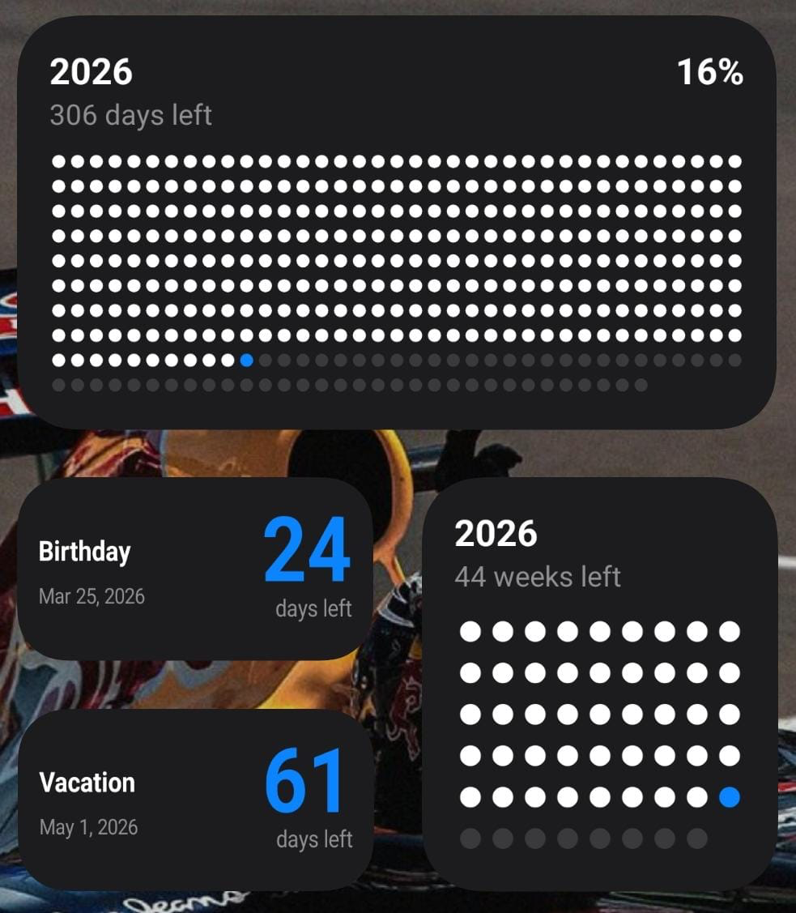

# YearByWeeks 📅

A minimal, elegant Android app to visualize your year's progress by weeks and days. Built with Kotlin and Jetpack Compose.


## 📱 Download

<a href="https://github.com/bhavesh-03/YearsByWeek/releases">
  
</a>

**[⬇️ Download Latest APK](https://github.com/bhavesh-03/YearsByWeek/releases)**

## 📸 Screenshot

<p align="center">
  
</p>

## ✨ Features

- **Year Progress Tracking** - Visualize how much of the year has passed
- **Weeks View** - Track progress by weeks remaining in the year
- **Days View** - Track progress by days remaining in the year
- **Home Screen Widgets** - Three beautiful widgets for your home screen:
  - 📊 **Weeks Progress Widget** - Shows weeks elapsed/remaining
  - 📅 **Days Progress Widget** - Shows days elapsed/remaining
  - ⏰ **Event Countdown Widget** - Custom countdown to any event
- **Dark Theme** - Beautiful dark mode design
- **Material 3 Design** - Modern Material You design language
- **Glance Widgets** - Built with Jetpack Glance for modern widget experience

## 🛠️ Tech Stack

- **Language:** Kotlin
- **UI Framework:** Jetpack Compose
- **Design System:** Material 3
- **Widgets:** Jetpack Glance
- **Background Work:** WorkManager
- **Min SDK:** 26 (Android 8.0)
- **Target SDK:** 36

## 🚀 Getting Started

### Prerequisites

- Android Studio Hedgehog (2023.1.1) or later
- JDK 17
- Android SDK 36

### Installation

1. Clone the repository:
   ```bash
   git clone https://github.com/bhavesh-03/YearsByWeek.git
   ```

2. Open the project in Android Studio

3. Sync Gradle and run the app on your device/emulator

### Building APK

To build a release APK:

```bash
./gradlew assembleRelease
```

The APK will be generated at `app/build/outputs/apk/release/`

## 🎨 Widgets

### Adding Widgets to Home Screen

1. Long press on your home screen
2. Select "Widgets"
3. Find "YearByWeeks" in the widget list
4. Choose from:
   - **Weeks Progress** - Shows week-based progress
   - **Days Progress** - Shows day-based progress
   - **Event Countdown** - Customizable countdown to any date

## 🤝 Contributing

Contributions are welcome! Please feel free to submit a Pull Request.

1. Fork the project
2. Create your feature branch (`git checkout -b feature/AmazingFeature`)
3. Commit your changes (`git commit -m 'Add some AmazingFeature'`)
4. Push to the branch (`git push origin feature/AmazingFeature`)
5. Open a Pull Request

## 📄 License

This project is licensed under the MIT License - see the [LICENSE](LICENSE) file for details.

## 👤 Author

**Bhavesh Manoj Mankar**

- GitHub: [@bhavesh-03](https://github.com/bhavesh-03)

## ⭐ Show Your Support

Give a ⭐️ if you like this project!

---

<p align="center">Made with ❤️ using Kotlin & Jetpack Compose</p>
