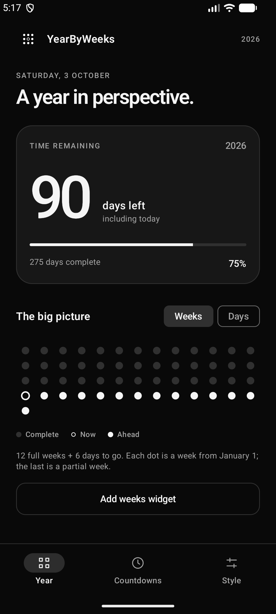

# YearByWeeks 📅

A minimal, elegant Android app to visualize your year's progress by weeks and days. Built with Kotlin and Jetpack Compose.


## 📱 Download

<a href="https://github.com/bhavesh-03/YearsByWeek/releases">
  
</a>

**[⬇️ Download Latest APK](https://github.com/bhavesh-03/YearsByWeek/releases)**

## 📸 Screenshot

<p align="center">
  
  
</p>

## ✨ Features

- **Year Progress Tracking** - Visualize how much of the year has passed
- **Weeks View** - Track progress by weeks remaining in the year
- **Days View** - Track progress by days remaining in the year
- **Home Screen Widgets** - Three beautiful widgets for your home screen:
  - 📊 **Weeks Progress Widget** - Shows weeks elapsed/remaining
  - 📅 **Days Progress Widget** - Shows days elapsed/remaining
  - ⏰ **Event Countdown Widget** - Custom countdown to any event
- **Appearance** - Minimal black-and-white System, Light, and Dark themes with a custom dot-grid icon
- **Widget opacity** - Adjustable from transparent to opaque, with live previews
- **Personal countdowns** - Create, edit, delete, and pin saved milestone cards
- **Focused navigation** - Dedicated Year, Countdowns, and Style screens
- **Glance Widgets** - Built with Jetpack Glance for modern widget experience

## Date calculations

Remaining year days **include today**. January 1 has 365 (or 366) days left, and December 31 has 1. Progress counts completed calendar days, so January 1 starts at 0%. This agrees with the countdown to the next January 1.

Week dots represent seven-day blocks beginning January 1, with a shorter final block. The weeks label shows full weeks plus remaining days. It does not use ISO week-year numbers, which can belong to the adjacent year around New Year.

Event countdowns use local calendar dates: today is 0, tomorrow is 1, and past events display days ago. Date-picker values are decoded as UTC calendar dates, avoiding timezone shifts.

The open app checks the date once a minute and whenever it resumes. Home-screen widgets check every 30 minutes while installed, but redraw only when the calendar date changes; relevant date or appearance changes trigger an immediate update. Android may defer background work while the device sleeps, so exact midnight widget updates are not guaranteed. Tap a countdown widget to edit its event. Appearance and background opacity apply to all widgets; text stays opaque.

## Verification

```bash
./gradlew testDebugUnitTest lintDebug assembleDebug
./gradlew connectedDebugAndroidTest
```

Unit tests cover leap years, year boundaries, every date in representative years, countdown signs, and calendar-week rollover. Emulator tests cover appearance, opacity persistence, and countdown creation, editing, and deletion.

The installable development APK is `app/build/outputs/apk/debug/app-debug.apk`. Distribution builds require your own release signing configuration.

## 🛠️ Tech Stack

- **Language:** Kotlin
- **UI Framework:** Jetpack Compose
- **Design System:** Material 3
- **Widgets:** Jetpack Glance
- **Background Work:** WorkManager
- **Min SDK:** 26 (Android 8.0)
- **Target SDK:** 36

## 🚀 Getting Started

### Prerequisites

- Android Studio Hedgehog (2023.1.1) or later
- JDK 17
- Android SDK 36

### Installation

1. Clone the repository:
   ```bash
   git clone https://github.com/bhavesh-03/YearsByWeek.git
   ```

2. Open the project in Android Studio

3. Sync Gradle and run the app on your device/emulator

### Building APK

To build a release APK:

```bash
./gradlew assembleRelease
```

The APK will be generated at `app/build/outputs/apk/release/`

## 🎨 Widgets

### Adding Widgets to Home Screen

1. Long press on your home screen
2. Select "Widgets"
3. Find "YearByWeeks" in the widget list
4. Choose from:
   - **Weeks Progress** - Shows week-based progress
   - **Days Progress** - Shows day-based progress
   - **Event Countdown** - Customizable countdown to any date

## 🤝 Contributing

Contributions are welcome! Please feel free to submit a Pull Request.

1. Fork the project
2. Create your feature branch (`git checkout -b feature/AmazingFeature`)
3. Commit your changes (`git commit -m 'Add some AmazingFeature'`)
4. Push to the branch (`git push origin feature/AmazingFeature`)
5. Open a Pull Request

## 📄 License

This project is licensed under the MIT License - see the [LICENSE](LICENSE) file for details.

## 👤 Author

**Bhavesh Manoj Mankar**

- GitHub: [@bhavesh-03](https://github.com/bhavesh-03)

## ⭐ Show Your Support

Give a ⭐️ if you like this project!

---

<p align="center">Made with ❤️ using Kotlin & Jetpack Compose</p>
